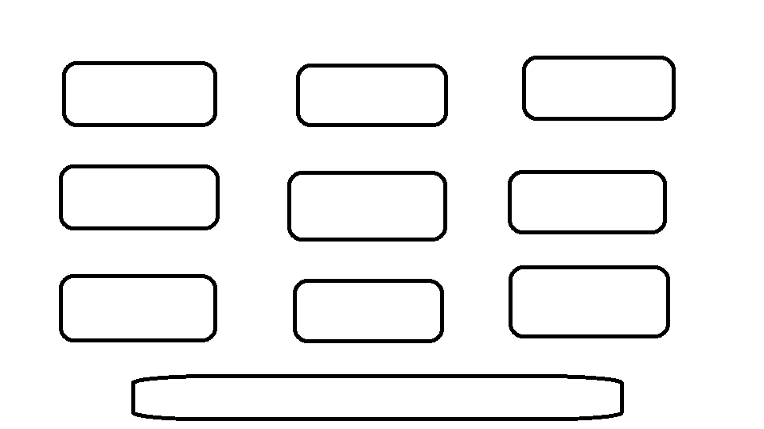

Joc Toni, Alex i Álvaro.

# Introducció

La nostra idea del programa consisteix d'una plataforma que conté diversos mini videojocs
a dins, tant individuals com col·lectius (2 jugadors o més). Simples i entenedors, els 
nostres jocs estaran disenyats, pensats i creats, per ser dinàmics i divertits.

La idea és fer-ne 9, per tal de fer un menú de 3x3 
Aquests haurien de ser de diverses temàtiques i gèneres, sempre conservant el mateix
estil gràfic.

## Jocs

Entre aquests es podrien fer:
 - Tir a la llauna (reversió de tir al plat, 1 jugador)
 - Ocell aletejador (reversió Flappy Bird, 1 jugador)
 - Pedra, Paper, Tisora (1 jugador contra la IA, 2 jugadors entre ells)
 - Tres en ratlla (1 jugador contra la IA (2 dificultats), 2 jugador entre ells)
 - Lluita de sables (2 jugadors entre ells)
 - Guaita l'obstacle (1 jugador)
 - 
 - 
 - 
